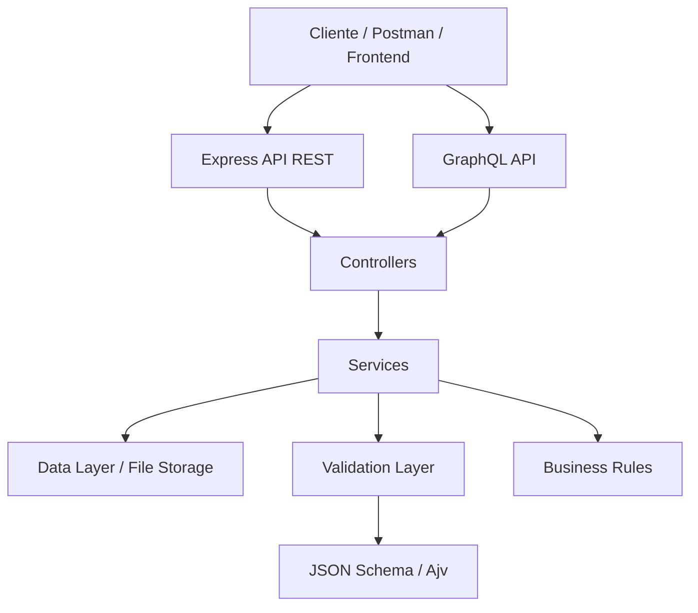
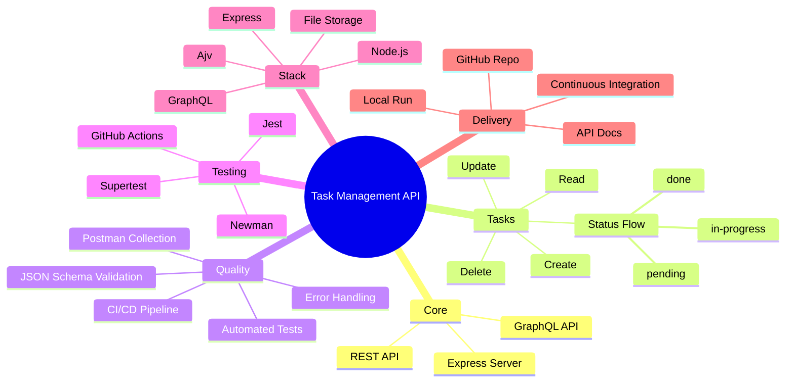

#  Task Management API

[](https://github.com/Letytorquato82/Mentoria-Julio-de-Lima/actions/workflows/ci.yml)
[](https://github.com/Letytorquato82/Mentoria-Julio-de-Lima)
[](http://localhost:3000/graphiql)

>  API REST e GraphQL para gestão de tarefas de sprint, com foco em automação de testes, validação de contratos e garantia de qualidade.

---

##  Visão Geral

Esta aplicação foi desenvolvida para demonstrar um fluxo completo de gerenciamento de tarefas em sprint, cobrindo operações de criação, leitura, atualização e exclusão de itens, além de suporte a consultas via GraphQL.

Com foco em qualidade de software, o projeto incorpora:
- testes automatizados
- validação de payloads
- boas práticas de API REST
- integração contínua com GitHub Actions

---

##  Arquitetura do Projeto
## Arquitetura do Projeto

O projeto segue uma **arquitetura em camadas (layered architecture)**, organizada de forma a separar claramente as responsabilidades entre entrada de dados, lógica de negócio e persistência. Essa abordagem facilita a manutenção, os testes e a evolução do sistema.

### 1. Camada de Consumo (Cliente)

O ponto de entrada da aplicação pode ser qualquer cliente HTTP — como um **frontend web**, o **Postman** (para testes manuais) ou qualquer outro consumidor de API. Essa camada é responsável apenas por enviar requisições e consumir as respostas.

### 2. Camada de API

O projeto expõe **duas interfaces de comunicação** em paralelo:

- **Express API REST** — endpoints tradicionais RESTful;
- **GraphQL API** — consultas e mutações via GraphQL.

Ambas convivem no mesmo backend, oferecendo flexibilidade para diferentes tipos de consumidores, mas convergem para o mesmo núcleo de processamento.

### 3. Controllers

Independentemente da interface utilizada (REST ou GraphQL), as requisições são direcionadas para os **Controllers**, que atuam como intermediários: recebem os dados de entrada, delegam o processamento para a camada de serviços e formatam as respostas.

### 4. Services

Os **Services** concentram a orquestração das regras da aplicação, atuando como uma ponte entre os Controllers e as camadas mais internas do sistema. É aqui que o fluxo de negócio é coordenado, distribuindo tarefas para três frentes:

- **Data Layer / File Storage** — responsável pelo acesso e persistência de dados, seja em banco de dados ou armazenamento de arquivos;
- **Validation Layer** — garante que os dados estejam corretos antes de serem processados, utilizando **JSON Schema / Ajv** para validação estrutural;
- **Business Rules** — aplica as regras de negócio específicas do domínio da aplicação.

### 5. Validação com JSON Schema / Ajv

A camada de validação utiliza **Ajv**, uma biblioteca de validação baseada em **JSON Schema**, garantindo que os dados que trafegam pelo sistema estejam sempre em conformidade com os formatos esperados, prevenindo erros e inconsistências antes que cheguem à lógica de negócio ou à persistência.

### Fluxo resumido

```
Cliente → API (REST ou GraphQL) → Controllers → Services → { Dados, Validação, Regras de Negócio }
```

Essa estrutura promove **baixo acoplamento** entre a interface de comunicação e a lógica interna, permitindo que múltiplas formas de acesso (REST/GraphQL) compartilhem a mesma base de regras e validações, sem duplicação de código.

---

##  Casos de Teste (Gherkin/BDD)

Os principais fluxos da API são documentados em formato Gherkin, permitindo especificar o comportamento esperado em linguagem legível para todos os stakeholders (devs, QAs, Product Owners).

### Feature: Gerenciar Tarefas - REST API

```gherkin
Feature: Task Management REST API
  Como usuário da API
  Quero gerenciar tarefas (criar, listar, buscar, atualizar e deletar)
  Para organizar e acompanhar o progresso de trabalhos em sprint

  Background:
    Given a aplicação está rodando em "http://localhost:3000"
    And o endpoint "/api/tasks" está disponível

  # ===== CREATE TASK =====
  Scenario: Criar uma tarefa com sucesso
    When faço uma requisição POST para "/api/tasks" com o corpo:
      """json
      {
        "title": "Implementar autenticação",
        "description": "Adicionar JWT à API",
        "status": "pending"
      }
      """
    Then o status da resposta deve ser 201
    And a resposta deve conter um "id"
    And o campo "title" deve ser "Implementar autenticação"
    And o campo "status" deve ser "pending"

  Scenario: Criar tarefa sem título retorna erro 400
    When faço uma requisição POST para "/api/tasks" com o corpo:
      """json
      {
        "description": "Descrição sem título"
      }
      """
    Then o status da resposta deve ser 400
    And a resposta deve conter mensagem de erro indicando que "title" é obrigatório

  Scenario: Criar tarefa com status inválido retorna erro 400
    When faço uma requisição POST para "/api/tasks" com o corpo:
      """json
      {
        "title": "Tarefa teste",
        "status": "invalid_status"
      }
      """
    Then o status da resposta deve ser 400
    And a resposta deve conter mensagem de erro sobre "status" inválido

  Scenario: Criar tarefa com description opcionalmente vazia
    When faço uma requisição POST para "/api/tasks" com o corpo:
      """json
      {
        "title": "Tarefa simples"
      }
      """
    Then o status da resposta deve ser 201
    And o campo "description" deve ser vazio ou nulo

  # ===== READ TASKS =====
  Scenario: Listar todas as tarefas com sucesso
    Given que existem 3 tarefas cadastradas
    When faço uma requisição GET para "/api/tasks"
    Then o status da resposta deve ser 200
    And a resposta deve ser um array
    And o array deve conter 3 itens

  Scenario: Listar tarefas quando não há nenhuma
    Given não há tarefas cadastradas
    When faço uma requisição GET para "/api/tasks"
    Then o status da resposta deve ser 200
    And a resposta deve ser um array vazio

  Scenario: Buscar uma tarefa específica por ID
    Given que existe uma tarefa com ID "1" e título "Tarefa teste"
    When faço uma requisição GET para "/api/tasks/1"
    Then o status da resposta deve ser 200
    And o campo "id" deve ser "1"
    And o campo "title" deve ser "Tarefa teste"

  Scenario: Buscar tarefa com ID inexistente retorna 404
    When faço uma requisição GET para "/api/tasks/9999"
    Then o status da resposta deve ser 404
    And a resposta deve conter mensagem indicando que a tarefa não foi encontrada

  # ===== UPDATE TASK (PUT - completa) =====
  Scenario: Atualizar tarefa completa com sucesso
    Given que existe uma tarefa com ID "1"
    When faço uma requisição PUT para "/api/tasks/1" com o corpo:
      """json
      {
        "title": "Tarefa atualizada",
        "description": "Nova descrição",
        "status": "in-progress"
      }
      """
    Then o status da resposta deve ser 200
    And o campo "title" deve ser "Tarefa atualizada"
    And o campo "status" deve ser "in-progress"

  Scenario: Atualizar tarefa sem título retorna erro 400
    Given que existe uma tarefa com ID "1"
    When faço uma requisição PUT para "/api/tasks/1" com o corpo:
      """json
      {
        "description": "Descrição sem título"
      }
      """
    Then o status da resposta deve ser 400
    And a resposta deve conter mensagem de erro

  Scenario: Atualizar tarefa inexistente retorna 404
    When faço uma requisição PUT para "/api/tasks/9999" com o corpo:
      """json
      {
        "title": "Título qualquer",
        "status": "pending"
      }
      """
    Then o status da resposta deve ser 404

  # ===== UPDATE STATUS (PATCH - parcial) =====
  Scenario: Atualizar apenas status da tarefa com sucesso
    Given que existe uma tarefa com ID "1" com status "pending"
    When faço uma requisição PATCH para "/api/tasks/1/status" com o corpo:
      """json
      {
        "status": "in-progress"
      }
      """
    Then o status da resposta deve ser 200
    And o campo "status" deve ser "in-progress"
    And os outros campos da tarefa devem permanecer inalterados

  Scenario: Atualizar para status inválido retorna erro 400
    Given que existe uma tarefa com ID "1"
    When faço uma requisição PATCH para "/api/tasks/1/status" com o corpo:
      """json
      {
        "status": "invalid"
      }
      """
    Then o status da resposta deve ser 400

  Scenario: Workflow de status válido: pending → in-progress → done
    Given que existe uma tarefa com ID "1" com status "pending"
    When faço uma requisição PATCH para "/api/tasks/1/status" com status "in-progress"
    Then o status da resposta deve ser 200
    And o campo "status" deve ser "in-progress"
    
    When faço uma requisição PATCH para "/api/tasks/1/status" com status "done"
    Then o status da resposta deve ser 200
    And o campo "status" deve ser "done"

  # ===== DELETE TASK =====
  Scenario: Deletar uma tarefa com sucesso
    Given que existe uma tarefa com ID "1"
    When faço uma requisição DELETE para "/api/tasks/1"
    Then o status da resposta deve ser 204

  Scenario: Deletar tarefa inexistente retorna 404
    When faço uma requisição DELETE para "/api/tasks/9999"
    Then o status da resposta deve ser 404

  Scenario: Tarefa deletada não pode ser recuperada
    Given que existe uma tarefa com ID "1"
    When faço uma requisição DELETE para "/api/tasks/1"
    And faço uma requisição GET para "/api/tasks/1"
    Then o status da resposta deve ser 404

  # ===== VALIDATION =====
  Scenario Outline: Validar tipos de dados na criação
    When faço uma requisição POST para "/api/tasks" com o corpo:
      """json
      {
        "title": <title>,
        "description": <description>,
        "status": <status>
      }
      """
    Then o status da resposta deve ser <expectedStatus>

    Examples:
      | title           | description    | status       | expectedStatus |
      | "Tarefa 1"      | "Desc"         | "pending"    | 201            |
      | "Tarefa 2"      | null           | "pending"    | 201            |
      | null            | "Desc"         | "pending"    | 400            |
      | 123             | "Desc"         | "pending"    | 400            |
      | "Tarefa 3"      | "Desc"         | "unknown"    | 400            |
```

### Feature: Gerenciar Tarefas - GraphQL API

```gherkin
Feature: Task Management GraphQL API
  Como desenvolvedor frontend
  Quero consultar e modificar tarefas via GraphQL
  Para obter apenas os campos necessários em uma única requisição

  Background:
    Given a aplicação está rodando em "http://localhost:3000"
    And o endpoint GraphQL "/graphql" está disponível

  Scenario: Consultar todas as tarefas via GraphQL
    When faço uma requisição GraphQL com a query:
      """graphql
      query {
        tasks {
          id
          title
          description
          status
        }
      }
      """
    Then o status da resposta deve ser 200
    And a resposta deve conter um array de tarefas
    And cada tarefa deve ter "id", "title" e "status"

  Scenario: Criar tarefa via GraphQL mutation
    When faço uma requisição GraphQL com a mutation:
      """graphql
      mutation {
        createTask(input: {
          title: "Nova tarefa GraphQL",
          description: "Teste de mutation",
          status: "pending"
        }) {
          id
          title
          status
        }
      }
      """
    Then o status da resposta deve ser 200
    And o campo "data.createTask.title" deve ser "Nova tarefa GraphQL"
    And o campo "data.createTask.id" deve estar presente

  Scenario: Atualizar tarefa via GraphQL mutation
    Given que existe uma tarefa com ID "1" via GraphQL
    When faço uma requisição GraphQL com a mutation:
      """graphql
      mutation {
        updateTask(id: "1", input: {
          title: "Tarefa atualizada via GraphQL",
          status: "in-progress"
        }) {
          id
          title
          status
        }
      }
      """
    Then o status da resposta deve ser 200
    And o campo "data.updateTask.status" deve ser "in-progress"

  Scenario: Deletar tarefa via GraphQL mutation
    Given que existe uma tarefa com ID "1" via GraphQL
    When faço uma requisição GraphQL com a mutation:
      """graphql
      mutation {
        deleteTask(id: "1") {
          success
          message
        }
      }
      """
    Then o status da resposta deve ser 200
    And o campo "data.deleteTask.success" deve ser true

  Scenario: Consultar apenas campos específicos via GraphQL
    Given que existem tarefas cadastradas
    When faço uma requisição GraphQL com a query:
      """graphql
      query {
        tasks {
          id
          title
        }
      }
      """
    Then o status da resposta deve ser 200
    And cada tarefa deve conter apenas "id" e "title" (sem "description" ou "status")

  Scenario: GraphQL retorna erro para query inválida
    When faço uma requisição GraphQL com a query:
      """graphql
      query {
        tasks {
          invalidField
        }
      }
      """
    Then o status da resposta deve ser 400
    And a resposta deve conter mensagem de erro indicando campo inválido
```

### Feature: Validação de Dados (JSON Schema)

```gherkin
Feature: Validação de Entrada (JSON Schema / Ajv)
  Como sistema
  Quero validar todos os dados de entrada
  Para garantir que apenas dados válidos cheguem à lógica de negócio

  Scenario: Payload com campos obrigatórios presentes é válido
    When valido o payload:
      """json
      {
        "title": "Tarefa completa",
        "description": "Descrição aqui",
        "status": "pending"
      }
      """
    Then a validação deve passar

  Scenario: Payload sem campo obrigatório "title" falha
    When valido o payload:
      """json
      {
        "description": "Sem título",
        "status": "pending"
      }
      """
    Then a validação deve falhar
    And a mensagem deve indicar que "title" é obrigatório

  Scenario: Campo "title" deve ser string
    When valido o payload:
      """json
      {
        "title": 123,
        "status": "pending"
      }
      """
    Then a validação deve falhar
    And a mensagem deve indicar que "title" deve ser string

  Scenario: Campo "status" só aceita valores permitidos
    When valido o payload com "status" = "pending"
    Then a validação deve passar
    
    When valido o payload com "status" = "in-progress"
    Then a validação deve passar
    
    When valido o payload com "status" = "done"
    Then a validação deve passar
    
    When valido o payload com "status" = "rejected"
    Then a validação deve falhar

  Scenario: Campo "description" é opcional
    When valido o payload:
      """json
      {
        "title": "Tarefa sem descrição"
      }
      """
    Then a validação deve passar

  Scenario: Payload com campos extras é rejeitado (strict mode)
    When valido o payload:
      """json
      {
        "title": "Tarefa",
        "status": "pending",
        "extraField": "não deve estar aqui"
      }
      """
    Then a validação deve falhar
    And a mensagem deve indicar campo desconhecido
```

**Nota:** Esses casos de teste (Gherkin) podem ser automatizados com ferramentas como **Cucumber.js** ou **CodeceptJS**, permitindo executar os mesmos cenários descritos acima de forma programática integrada ao pipeline de CI/CD.




---

## 🧠 Mapa Mental do Projeto



---

##  Stack Tecnológica

- **Node.js** 18+
- **Express**
- **Ajv** para validação de schemas
- **GraphQL**
- **Jest + Supertest** para testes automatizados
- **Newman + Postman** para execução de coleções
- **GitHub Actions** para CI/CD

---

##  Funcionalidades

- CRUD completo de tarefas
- Controle de status: `pending`, `in-progress`, `done`
- Validação de entrada com JSON Schema
- Endpoints RESTful
- Suporte a consultas GraphQL
- Persistência local em arquivo
- Integração contínua configurada

---

##  Instalação

### 1) Clone o repositório
```bash
git clone https://github.com/Letytorquato82/Mentoria-Julio-de-Lima.git
cd Mentoria-Julio-de-Lima
```

### 2) Instale as dependências
```bash
npm install
```

### 3) Inicie a aplicação
```bash
npm start
```

### 4) Acesse a API
```text
http://localhost:3000
```

---

##  Comandos Úteis

- `npm install` — instala as dependências
- `npm start` — inicia a API
- `npm test` — executa a suíte de testes
- `npm run postman` — executa a coleção Postman via Newman
- `npm run audit:fix` — tenta corrigir vulnerabilidades de dependências

---

##  Endpoints REST

- `GET /api/tasks` — lista todas as tarefas
- `POST /api/tasks` — cria uma nova tarefa
- `GET /api/tasks/:id` — busca uma tarefa por ID
- `PUT /api/tasks/:id` — atualiza uma tarefa completa
- `PATCH /api/tasks/:id/status` — atualiza o status da tarefa
- `DELETE /api/tasks/:id` — remove uma tarefa

---

##  Exemplos de Requisição

### Listar tarefas
```bash
curl -X GET "http://localhost:3000/api/tasks"
```

### Criar tarefa
```bash
curl -X POST "http://localhost:3000/api/tasks" \
  -H "Content-Type: application/json" \
  -d '{"title":"Implementar endpoint de tarefa","description":"Criar API REST para gestão de entregas","status":"pending"}'
```

### Buscar tarefa por ID
```bash
curl -X GET "http://localhost:3000/api/tasks/1"
```

### Atualizar tarefa
```bash
curl -X PUT "http://localhost:3000/api/tasks/1" \
  -H "Content-Type: application/json" \
  -d '{"title":"Tarefa atualizada","description":"Descrição atualizada","status":"in-progress"}'
```

### Atualizar status
```bash
curl -X PATCH "http://localhost:3000/api/tasks/1/status" \
  -H "Content-Type: application/json" \
  -d '{"status":"done"}'
```

### Deletar tarefa
```bash
curl -X DELETE "http://localhost:3000/api/tasks/1"
```

---

##  Modelo de Dados

```json
{
  "title": "Implementar endpoint de tarefa",
  "description": "Criar API REST para gestão de entregas",
  "status": "pending"
}
```

### Campos
- `title`: string obrigatória
- `description`: string opcional
- `status`: enum com valores `pending`, `in-progress`, `done`

---

##  Testes

### Testes automatizados
```bash
npm test
```

### Coleção Postman
A coleção e o ambiente de teste estão localizados em:
- `postman/TaskManagement.postman_collection.json`
- `postman/TaskManagement.postman_environment.json`

---

##  GraphQL

O projeto também oferece suporte a GraphQL:

- Endpoint: `http://localhost:3000/graphql`
- Interface: `http://localhost:3000/graphiql`

### Consulta de exemplo
```graphql
query {
  tasks {
    id
    title
    description
    status
  }
}
```

### Mutation de exemplo
```graphql
mutation {
  createTask(input: { title: "Nova tarefa", description: "Descrição", status: "pending" }) {
    id
    title
    status
  }
}
```

---

##  CI/CD

O projeto inclui pipeline automatizado em GitHub Actions para:
- instalação de dependências
- execução de testes
- validação de coletânea Postman
- auditoria de vulnerabilidades

Arquivo:
- `.github/workflows/ci.yml`

---

##  Observações

- A persistência atual é local, em arquivo.
- O objetivo principal é demonstrar arquitetura, qualidade e testes em API.
- O projeto foi organizado para fácil entendimento e futura extensão.

---

##  Contato

Para dúvidas, sugestões ou melhorias, abra uma issue no repositório ou entre em contato pelo GitHub.

---

