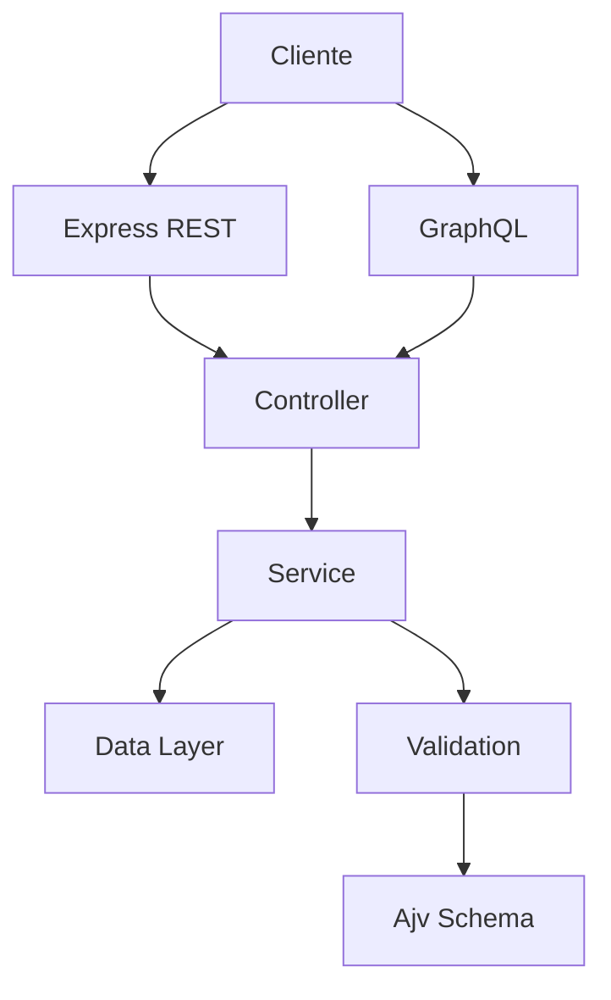

# 🏗️ Arquitetura

## Visão geral

O projeto segue uma estrutura simples, organizada em camadas para facilitar manutenção e compreensão:

- camada HTTP: Express e GraphQL
- camada de regras de negócio: serviços
- camada de dados: armazenamento em arquivo/local
- camada de validação: schemas com Ajv
- camada de testes: Jest, Supertest, Newman, k6

## Fluxo principal

## Responsabilidades

### Controller
Responsável por receber a requisição HTTP, validar entrada básica e devolver a resposta adequada.

### Service
Responsável pelo fluxo de negócio, regras e manipulação de dados.

### Data Layer
Persistência leve em arquivo, adequada para ambiente de desenvolvimento e portfólio.

### Validation
Validação de payloads e regras estruturais antes do processamento.

## Benefícios da arquitetura

- separação clara de responsabilidades
- fácil manutenção
- testes mais focados
- boa legibilidade para revisão e apresentação
